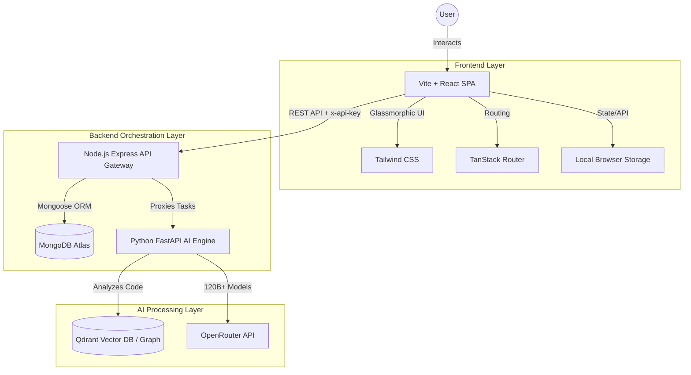

# 🚀 CodePilot AI: Autonomous Engineering Operating System

**A High-Performance, Hybrid-Architecture AI Workspace for Modern Developers**

[](https://vitejs.dev/)
[](https://reactjs.org/)
[](https://www.typescriptlang.org/)
[](https://nodejs.org/)
[](https://www.python.org/)
[](https://fastapi.tiangolo.com/)
[](https://www.mongodb.com/)
[](https://openrouter.ai/)

---

## 📌 Project Overview

### **The Problem Statement**

Modern software engineering involves juggling documentation, architectural planning, security audits, and code implementation. Existing AI chat tools are disconnected from the codebase and lack specialized, domain-specific reasoning. Developers need a persistent, autonomous workspace that understands their entire repository structure and can execute specialized missions.

### **The Solution**

**CodePilot AI** is a world-class AI Engineering Operating System. It replaces generic chatbots with a team of specialized, autonomous AI agents (Principal Architect, QA Specialist, SecOps Lead, etc.), each powered by industry-leading 120B+ parameter models via OpenRouter. 

### **Core Objectives & Business Value**

- **Autonomous Workforce**: Delegate complex engineering tasks to a specialized team of AI personas.
- **Automated Documentation**: Instantly generate comprehensive `ARCHITECTURE.md` files for any imported repository.
- **Enterprise-Grade Architecture**: A highly scalable hybrid microservices design using Node.js, Python, and MongoDB.
- **Bring Your Own Key (BYOK)**: Secure, local storage of OpenRouter API keys to minimize server overhead.

---

## 🏗 System Architecture

CodePilot AI follows a modular, component-based architecture designed for extreme performance and scalability, splitting the workload between a fast Node.js gateway and a heavy-lifting Python AI engine.



---

## ⚙️ Development Methodology

### **Engineering Challenges & Implementations**

- **Hybrid Microservices**: Built a dual-backend system where Node.js handles fast, asynchronous I/O (authentication, database reads, API routing) while Python handles heavy AI processing, embedding generation, and language model orchestration.
- **Dynamic Model Routing**: Integrated OpenRouter to dynamically route prompts to the best-suited model for the task, utilizing `nvidia/nemotron-3-super-120b-a12b` for architecture and `google/gemma-4-31b-it` for coding tasks.
- **Premium UI/UX**: Designed a stunning "Neo-Glassmorphic" interface featuring multi-layered blur effects, CSS noise overlays, and `framer-motion` sequenced animations to give the platform a futuristic, premium feel.

---

## ✨ Features Breakdown

| Feature | Description | Implementation Detail |
| :--- | :--- | :--- |
| **Agent Teams Dashboard** | Visualizes the autonomous workforce | Glassmorphic grid animated with Framer Motion, displaying live status and specialized capabilities of each AI persona. |
| **Auto-Documentation Generator** | One-click architectural documentation | Frontend triggers Node.js proxy -> Python FastAPI -> OpenRouter (120B model) to analyze the repo and stream back a full `ARCHITECTURE.md`. |
| **BYOK Security System** | "Bring Your Own Key" architecture | Securely stores the user's OpenRouter API key in local storage. Injects it into the `x-api-key` header of API requests so the backend uses the client's quota. |
| **MongoDB Atlas Integration** | Cloud database for persistent state | Express backend uses Mongoose to store repository metadata, user preferences, and AI mission history securely in the cloud. |
| **Hybrid Backend Proxy** | Seamless communication between services | Node.js Gateway handles standard CRUD and UI state, seamlessly proxying complex AI execution tasks to the Python engine. |

---

## 🛠 Tech Stack

### **Frontend Excellence**
- **React 19 & Vite**: Lightning-fast HMR and modern concurrent rendering.
- **TypeScript**: Ensuring type-safety across the entire stack.
- **Tailwind CSS**: Utility-first styling with custom glassmorphism and animated borders.
- **Framer Motion**: Smooth, staggered animations and fluid state transitions.
- **TanStack Router**: Type-safe, file-based routing for complex single-page applications.

### **Backend Infrastructure**
- **Node.js + Express**: High-concurrency API Gateway and business logic orchestrator.
- **MongoDB Atlas + Mongoose**: Scalable, cloud-native NoSQL database for flexible schema management.
- **Python + FastAPI**: High-performance AI engine for embedding processing and LLM interactions.
- **Qdrant**: (Planned) Vector database for semantic code search and Retrieval-Augmented Generation (RAG).

### **AI & Integrations**
- **OpenRouter**: Unified API access to the world's most powerful open-source and proprietary LLMs.
- **Nvidia Nemotron 120B**: Used for complex system architecture and reasoning.

---

## 📂 Folder Structure

```text
codepilot-ai/
├── frontend/                # Vite + React UI
│   ├── src/
│   │   ├── components/      # Reusable UI elements (Sidebar, etc.)
│   │   ├── routes/          # TanStack File-based routes (dashboard, agent-teams)
│   │   └── lib/             # API client and utilities
├── backend/                 # Node.js API Gateway
│   ├── src/
│   │   ├── config/          # MongoDB & Environment setup
│   │   └── modules/         # Domain-driven feature modules (mission, project)
└── ai-engine/               # Python FastAPI Engine
    ├── main.py              # Server entrypoint
    ├── requirements.txt     # Python dependencies
    └── utils/
        └── openrouter.py    # LLM integration logic
```

---

## 🚀 Getting Started

### Prerequisites
- Node.js v22+
- Python 3.10+
- MongoDB Atlas Account
- OpenRouter API Key

### 1. Start the Node.js Backend
```bash
cd backend
npm install
# Add your MongoDB string to backend/.env
npm run dev
```

### 2. Start the Python AI Engine
```bash
cd ai-engine
python -m venv venv
# Activate venv (Windows: .\venv\Scripts\activate, Mac/Linux: source venv/bin/activate)
pip install -r requirements.txt
uvicorn main:app --reload --port 8000
```

### 3. Start the Frontend
```bash
cd frontend
npm install
npm run dev
```
Navigate to `http://localhost:5173`. Go to Settings -> API Keys and enter your OpenRouter Key to begin!

---

<div align="center">
  <h3><b>CodePilot AI</b></h3>
  <p>The Future of Autonomous Engineering.</p>
</div>
