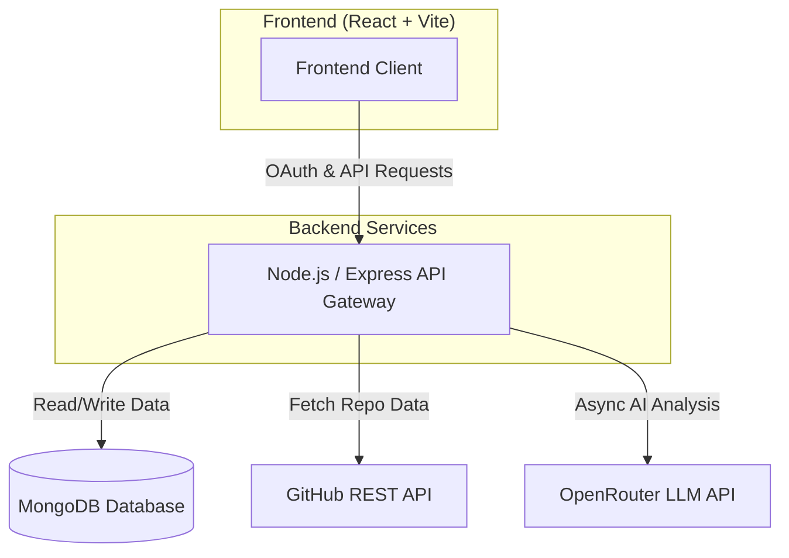

<div align="center">
  
  <h1>Sarathi.ai (formerly CodePilot)</h1>
  <p><strong>Your AI Engineering Mentor: From Student Project to Production-Ready.</strong></p>
  
  []()
  []()
  []()
  []()
  []()
</div>

<br />

## 📌 Project Overview

### The Problem
There is a massive gap between a project that "works on my machine" and software that is truly **production-ready**. Junior developers, students, and self-taught programmers often struggle to implement enterprise-grade system architecture, proper security hardening, and scalable testing environments. Furthermore, 1-on-1 mentorship from Senior Engineers is expensive, scarce, and time-consuming.

### The Solution: Sarathi.ai
**Sarathi.ai** bridges this gap by acting as an automated Senior Engineering Mentor. By simply providing a GitHub repository URL, Sarathi scans the codebase, evaluates the technology stack, and utilizes advanced Large Language Models (LLMs) to perform a comprehensive code review. 

### Core Objectives & Business Value
- **Accelerated Learning:** Turns ambiguous feedback into an actionable, week-by-week implementation roadmap.
- **Enterprise Standards:** Enforces best practices in System Design, Security, Performance, and Maintainability.
- **Recruitment & Portfolio Value:** Helps developers elevate their side projects into impressive, MNC-level portfolio assets that stand out to tech recruiters.

---

## 🏗 System Architecture

Sarathi.ai is built using a modern microservices-inspired architecture, ensuring clear separation of concerns, scalability, and robust performance.



### Module Interactions
1. **Authentication:** Users authenticate via Google OAuth. The Node backend issues a JWT for secure, stateless sessions.
2. **Repository Import:** The Node API communicates with the GitHub REST API to fetch repository metadata, commit history, and README contents.
3. **AI Analysis Engine:** Instead of blocking the main thread, the AI evaluation is processed asynchronously using OpenRouter (Nemotron 120B / Claude). It scores the project across 7 critical domains (Architecture, Security, Performance, etc.) and generates a structured JSON roadmap.
4. **Data Persistence:** All projects, missions, and roadmaps are securely stored in MongoDB for future retrieval.

---

## ⚙️ Development Methodology

The project was developed using an **Agile Methodology**, allowing for rapid iteration and continuous integration of user feedback.

- **Sprint Planning:** Work was divided into logical sprints focusing first on core infrastructure (Auth, DB), followed by AI integration, and concluding with UX/UI polishing.
- **Iterative Refinement:** The AI prompt engineering went through multiple iterations to ensure the LLM output was deterministic, strictly formatted as JSON, and highly actionable.
- **Continuous Improvement:** We implemented background polling to prevent UI blocking during the ~30-second AI generation process, drastically improving the User Experience.

---

## ✨ Features Breakdown

### 1. Seamless GitHub Integration
- **Purpose:** Eliminate friction in project onboarding.
- **Implementation:** Users simply paste a repository URL. The backend automatically extracts the owner, repo name, programming languages, and frameworks.

### 2. Comprehensive AI Code Review
- **Purpose:** Identify architectural flaws and security vulnerabilities.
- **Implementation:** Evaluates the codebase against enterprise standards and generates an overall score alongside a detailed breakdown in categories like Scalability and Maintainability.

### 3. Actionable Week-by-Week Roadmap
- **Purpose:** Provide a clear path to improvement.
- **Implementation:** The AI generates a structured roadmap detailing exactly what to do each week (e.g., "Week 1: Implement JWT Authentication", "Week 2: Set up CI/CD pipeline").

### 4. Background Asynchronous Processing
- **Purpose:** Ensure the UI remains responsive during heavy AI computations.
- **Implementation:** The backend immediately creates an `in_progress` mission and processes the OpenRouter API call in the background. The frontend actively polls for completion.

---

## 🛠 Tech Stack

### Frontend
- **Framework:** React 18 with TypeScript
- **Build Tool:** Vite
- **Routing:** TanStack Router (Type-safe routing)
- **Styling:** Tailwind CSS, Framer Motion (for micro-animations), Lucide Icons
- **State Management:** React Hooks & LocalStorage

### Backend
- **Environment:** Node.js, Express.js
- **Language:** TypeScript
- **Database:** MongoDB (via Mongoose)
- **Security:** Helmet, Express Rate Limit, CORS, JSON Web Tokens (JWT)

### AI & Integrations
- **AI Engine:** OpenRouter API
- **External APIs:** GitHub REST API, Google OAuth 2.0

---

## 📂 Folder Structure

```text
codepilot-ai/
├── frontend/                 # React UI Client
│   ├── src/
│   │   ├── components/       # Reusable UI components (Sidebar, Nav, Hero)
│   │   ├── lib/              # Utilities, API wrappers, Auth logic
│   │   └── routes/           # TanStack file-based routing views
├── backend/                  # Node.js API Gateway
│   ├── src/
│   │   ├── modules/          # Domain-driven modules (auth, project, mission, repository)
│   │   ├── shared/           # Shared middlewares (JWT Auth, Error Handling)
│   │   └── index.ts          # Express Server Entry Point
└── ai-engine/                # Python FastAPI Microservice (Optional Fallback)
```

---

## 🔄 Application Workflow

1. **Authentication Flow:** User clicks "Log in", gets redirected to Google's OAuth consent screen, and returns to the app with a JWT stored securely.
2. **Dashboard Initialization:** The user views their connected projects or is prompted to import a new one.
3. **Repository Import & Analysis:**
   - User pastes `https://github.com/user/repo`.
   - The backend validates the URL and fetches repo details.
   - The user clicks "Run Review".
   - The backend immediately creates a pending task and starts talking to the AI in the background.
4. **Interactive Polling:** The React frontend polls the backend every 5 seconds.
5. **Results Generation:** Once the AI finishes, the dashboard automatically updates to display the project scores, vulnerability reports, and the week-by-week implementation roadmap.

---

## 📊 Engineering Decisions

- **Why TanStack Router?** Chosen for its excellent TypeScript support and type-safe routing, preventing dead links and runtime routing errors.
- **Why Background AI Processing?** Large context LLM requests take 30+ seconds. Blocking the Express request thread would lead to timeouts and a poor user experience. Moving this to an async background task ensures high availability.
- **Why MongoDB?** The AI generates highly nested, dynamic JSON structures (roadmaps, category scores). A NoSQL document database allows us to store these structures flexibly without complex SQL joins.
- **Security Hardening:** The API uses `helmet` to set secure HTTP headers, `express-rate-limit` to prevent brute-force attacks on AI endpoints, and strictly configured CORS to prevent unauthorized cross-origin requests.

---

## 🧪 Testing & Validation

- **UI Responsiveness:** Thoroughly tested across Desktop, Tablet, and Mobile breakpoints using Tailwind's mobile-first utilities.
- **Graceful Error Handling:** If the AI provider times out or fails to return valid JSON, the system catches the error and generates a structured fallback response, ensuring the app never crashes.
- **Auth Flow Testing:** Validated token lifecycle, expiration handling, and seamless redirection mechanics.

---

## 🚀 Future Enhancements

- **Direct GitHub App Integration:** Moving from a simple URL paste to a full GitHub App installation, allowing Sarathi to automatically create Pull Requests with fixes.
- **CI/CD Pipeline Integration:** Adding webhooks so Sarathi automatically reviews code every time a user pushes a new commit to their branch.
- **WebSockets:** Upgrading from HTTP polling to WebSockets (Socket.io) for real-time progress updates during the AI generation phase.

---

<div align="center">
  <i>Built with ❤️ for developers looking to level up their engineering skills.</i>
</div>
